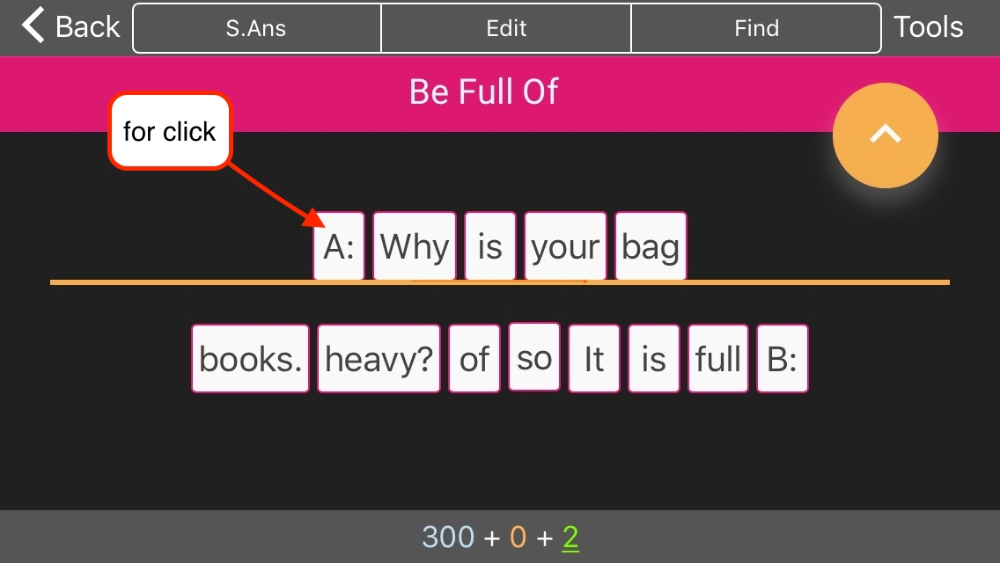

# Anki Theme 
## Scrambled-Sentences-for-Anki.
- [Some necessary operations](#some-necessary-operations-for-this-template)
- [Optional recommended](#optional-recommended)
- [Some rule](#some-rule)
- [Card Fields](#card-fields)

This Anki theme will help make your English decks a little more effectively. [Janki method](https://apps.ankiweb.net/docs/manual.html#spaced-repetition), spaced repetition software is a helpful learning tool for English grammar from beginner to experienced.

The template is built in html, javascript and css. Include fields: audio, transcriptions.

#### Some notes from official site.
> ##### [Self-made versus pre-made](https://apps.ankiweb.net/docs/manual.html#downloading-shared-decks)
Creating your own deck is the most effective way to learn a complex subject. Subjects like languages and the sciences can’t be understood simply by memorizing facts — they require explanation and context to learn effectively. Furthermore, inputting the information yourself forces you to decide what the key points are, leading to a better understanding.

 > Do not learn if you do not understand.
—[SuperMemo](https://www.supermemo.com/en/articles/20rules)


### Notes
>Each Anki client and each Anki version may implement card display differently, so you will need to test the behaviour across platforms. 
Currently was tested only Mac clients (desctop and iPad). But was made responsive layout for iPhones versions. 
Also was tested on the Windows 10 (desctop) last version Anki.

## Card Types
There are currently one type of card.<br>
 **[Basic]**
  - Freeform show/hide, question/answer, audio/subtitles fields.<br><br>

#### some necessary operations for this template:
>- Anki doesn’t import fonts, so you need install these fonts **to your OS**:<br>
_Roboto-Regular.ttf
_Roboto-ThinItalic.ttf<br>
For instaling in a folder `Reference files/fonts`
- On mobile version it is necessary switch off tap zones.
- Instal a plug-in: [Replay buttons on card](https://ankiweb.net/shared/info/498789867) for sound fields.

### Optional recommended
- For convenient filling of forms instal a plug-in: [Power Format Pack: Markdown, code blocks, lists, tables, syntax highlight & more](https://ankiweb.net/shared/info/162313389)
- [Additional Card Fields](https://ankiweb.net/shared/info/441235634) for distinction by left border's color near expresion:<br>
new card = blue<br>
studied card = maroon<br>
Repeated card = green<br>
`.q0 { color: blue; }`<br>
`.q1 { color: maroon; }`<br>
`.q2 { color: darkgreen; }`<br>


## Some rule
- If you need reset scrambled sentences to right order just click on the first word in stage.



## Card Fields
Fields marked **Optional** fields (♟ ♻ ✎ ♫ ♨) can be left blank and the template will ignore them. **Required** fields (✔) are required in order for a card to be generated.
### ✔ID: 
Required

### ✔ »»♻«« Examples:
Required
Each phrase should be divided by a semicolon ";" except last expression.
or 
``` html
<ul>
	<li>"expression1"</li>
	<li>"expression2"</li>
	<li>"expression3"</li>
	<li>"expression4"</li>
</ul>
```
>**example** - 
``` 
		pick out one you like!;
		She picked out a nice dress for the party.;
		I picked out the best apple in the basket.;
		A: I want to buy a shirt, but I don't know which color to get. B: I'll help you pick out a color!
```

This template support max 10 list - and in a form as in an example up only. The order of list will be scramble.

### »»♻«« Translation
Optional
It's recommended that Number of this field's list will be match with number of field's list " »»♻«« Examples " is recommended, but it won't crash template.
Each of sentences of Translation list order should be equal to target language list order, as you understand ).

Each phrase should be divided by a semicolon ";" except last expression.
or
``` html
<ul>
	<li>"expression1"</li>
	<li>"expression2"</li>
	<li>"expression3"</li>
	<li>"expression4"</li>
</ul>
```
>**example** - 
``` 
		<i>выберите тот, который Вы любите!;</i>
		Она выбрала хорошее платье для вечеринки.;
		Я выбрал лучшее яблоко в корзине.;
		A: Я хочу купить рубашку, но я не знаю какой цвет подобрать. B: Я помогу Вам выбрать цвет!
```

### ♫ Audio:
Optional
### ☛ Expression
Optional
>**example** - pick out

### ♞ Meaning
Optional
> **example** -<br>
choose; single out

### ♨ Image
Optional